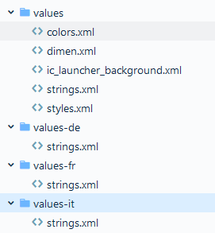

# SYM - Laboratoire 1

> Auteurs: Melvin Merk, Yohann Paulus & Doran Kayoumi

## Premières constatations

### Langue de l'interface

Avoir les textes de l'application dans un fichier XML externe rendra plus simple la réutilisation des textes. Quand l'on souhaite les utiliser, il suffit de la référencer dans le code en utilisant son nom `R.id.<name>`. Dans le cas ou nous avons une application multi-langue, il suffit de définir d'autre fichier XML pour les langues que nous souhaitons utiliser. Ensuite Android va référencer la bonne traduction selon la langue de l'appareil.

**Langue par défaut**

```xml
<resources>
    <string name="main_email_hint">Your e-mail address</string>
    // ...
</resources>
```

**Traduction**

```xml
<resources>
    <string name="main_email_hint">Votre adresse e-mail</string>
	// ...
</resources>
```

Tous les fichiers de traduction `strings.xml` se trouvent dans un dossier `values/` dans les ressources de l'application: `app/src/main/res`. Les langues "supplémentaires" se trouvent dans un dossier avec l'abréviation de celle-ci (e.g. français -> `values-fr`).

> Remarques: La langue par défaut se trouve dans le dossier `values/`.




Dans le cas où il manquerait une traduction pour l'une des langues additionnelle, l'application va compiler sans problème et  elle va utiliser la/les traductions de la langue par défaut pour toutes les valeurs manquante. Par contre, si c'est une traduction de la langue par défaut qui est  manquante, l'application ne va pas pouvoir compiler, car Android ne  saura pas quoi utiliser comme valeurs lors du référencement de cette  valeur. Un comme si l'on souhaite utiliser une variable non déclarée.

### Champs textuels de saisie
Pour l'addresse mail nous avons rajouté dans auth_fields.xml les lignes ```android:inputType="textEmailAddress"``` pour la saisie du mail et ```android:inputType="textPassword"``` pour la saisie du mot de passe.
### Mode paysage 
Pour le mode paysage, on a crée un nouveau dossier ```layout-land``` qui contient également un fichier activity_main.xml. Celui-ci permet de définir le comportement de l'application lorsque le téléphone est orienté en mode paysage.


## Gestion des événements et mise à jour de l'interface

### Vérification du format de l'email

Pour la validation du format de l'email, nous avons utilisé une expression régulière.

```kotlin
fun validateEmail(email: String): Boolean {
  val regex = """^[a-zA-Z0-9_]+(?:.[a-zA-Z0-9_-]+)*@(?:[a-zA-Z0-9-]+\.)+[a-zA-Z]{2,7}$""".toRegex()
  return regex.matches(email)
}
```

Une autre solution serait d'utiliser le package `android.util.Patterns` qui fournit, entre autres, un pattern pour les adresses email.

```kotlin
fun validateEmail(email: String): Boolean {
  return android.util.Patterns.EMAIL_ADDRESS.matcher(str).matches()
}
```

### Verification du couple email/mot de passe

Pour vérifier si le couple email et mot de passe renseigné par l'utilisateur, nous effectuons une recherche de ce couple dans la liste des credentials.

> Remarques: Nous avons changé la liste donnée en une liste mutable. Ceci pour nous permettre d'ajouter des nouveaux credentials sans devoir recréer la liste.

```kotlin
credentials.any {
  it == Pair(email, password)
}
```

Dans un cas réel (i.e. non-académique), il faudrait que les mots de passe stockés dans la base de données (ici en mémoire) soient hashé  (avec un algorithme tel que `argon2`) et donc avant de pouvoir effectuer la recherche, le mot de passe saisi doit être hashé.


En cas d'échec, nous affichons une dialogue avec un message d'erreur.

```kotlin
AlertDialog.Builder(this).apply {
  setTitle("Failed authentication")
  setMessage("Your login details are incorrect")
  setPositiveButton("Ok") { dialog, _ ->
    dialog.dismiss()
  }.create().show()
}
```

## Passage à une autre activité

### Création et lancement de la nouvelle activité
Pour commencer nous avons commencé par crée le fichier ```ProfileActivity.kt```et le fichier xml correspondant ```activity_profile.xml```. Le premier fichier contient le code kotlin qui redéfini la fonction "onCreate()" qui rédige le comportement de l'application lors de la création de l'activitée. Le se fichier xml qui permet de définir le layout. L'activité est lancée depuis ```MainActivity.kt``` avec la fonction ```startActivity()```qui prend en paramètre un ```Intent```. L'Intent permet de décrir abstraitement l'opération à effectué et les paramètres que cette opération nécessite (voir point suivant).

### Passage de paramètres à la nouvelle activité
Comme dit précédemment, l'Intent permet de passer des paramètres. Dans notre cas, c'est pour le lancement d'une nouvelle activité avec comme paramètre l'addresse mail de l'utilisateur qui vient de se connecter. Pour ce faire on utilise la méthode ```putExtra()``` qui permet de lier un identifiant avec une variable existante dans l'activité "principale". Pour récupéré la valeur dans la seconde activité, on utilise l'appel ```intent.getStringExtra()``` qui prend un identifiant en paramètre et on stocke le résultat dans une variable.

### Permissions simples
Afin d'autorisé l'application à accédé à internet, nous avons du rajouter la ligne ```<uses-permission android:name="android.permission.INTERNET"/>``` dans le fichier ```AndroidManifest.xml```. Le fichier manifest décrit les informations essentielles à propos de l'application aux outils de builds, à l'OS et au service Google Play.


## Navigation entre les activités

### Création et lancement de la nouvelle activité

Comme décrit dans la donnée, il existe deux méthodes principales pour lancer une nouvelle activité. Celle de la librairie standard d'Android et une deuxième qui est introduite par la librairie AndroidX. La version historique/standard est officiellement dépréciée depuis la version [1.3.0-alpha04](https://developer.android.com/jetpack/androidx/releases/fragment#1.3.0-alpha04). Nous avons donc décidé d'utiliser la solution proposée par AndroidX.

#### Librairie standard

Vu que c'est une solution qui se trouve dans la  librairie standard, elle est actuellement fonctionnel/utilisable sur  toutes les versions d'Android.

Même si c'est une solution qui est dans la librairie standard et qu'elle est toujours utilisable, **mais** depuis l'API 28, elle est déprécié et ne recevra plus de nouvelle release.

#### Librairie AndroidX

Cette nouvelle solution réduit la complexité du code  lors du lancement d'une nouvelle activité ou fragment et simplifie aussi la demande de permission (e.g. accéder à la caméra). Avec la méthode de la librairie standard, il faut manuellement vérifier la version d'Android utilisé et si l'autorisation n'a pas déjà était  autorisé. Avec la nouvelle API, ces vérifications sont intégrées dans les méthodes de celles-ci.

Étant donné que c'est une librairie "récente", elle est seulement compatible avec des versions d'android >= **9.0**, et donc une application qui utilise cette solution ne fonctionnera pas sur des plus vieux appareil.

### Affichage d'une image
Dans le fichier "drawable" nous avons rajouté l'image que nous souhaitions incorporé à l'application. Ensuite nous avec crée une balise "ImageView" dans le fichier ```activity_register.xml``` qui contient toutes les caractérstique de notre image. Nous lui avons ensuite renseigner le chemin d'accès de l'image avec la ligne : ```android:src="@drawable/pand_roux"```. Le dossier "res/drawable" est l'emplacement des images par défaut. En général on y trouve tous les drawable qui ne dépendent pas de la taille de l'écran. Pour les images matricielles, si l'on veut garentir la bonne qualité de notre image peut importe l'appareil, il est nécessaire de fournir différentes version de l'image : MDPI, HDPI, XHDPI, XXHDPI,XXXHDI. Si l'image n'est pas disponible, android va soomer l'image pour qu'elle utilise l'espace qui lui est réservé. Cela va bien évidement déformer l'image et réduire ça qualité. C'est donc beaucoup plus judicieux d'utiliser des images vectorielles car elles sont scalables et ne perdent pas en qualité. Cependant les images vectorielles sont plus généralement utilisé pour des illustrations comme des logos et non pour des images.

### Factorisation du code
Étant donné que l'activité main (i.e. page de login) et l'activité de register on tout deux besoin du même processus de validation, nous avons créé une fonction qui contient ce processus. Cette fonction prend, entre autres, en argument les `EditText` (email et mot de passe) du formulaire (i.e. les champs input que l'utilisateur va remplir) à valider, puis vérifie que les champs ne soit pas vide, que la syntaxe de l'email soit correct (Voir [ici](#Vérification du format de l'email)) et que le mot de passe saisie respect la police de mot de passe que nous avons définie. Cette dernière validation est seulement effectuée si l'arguement `policyCheck` est a **true**. Dans le cas où il y a une erreur, on met un/des messages d'erreurs. IL nous faut donc aussi le contexte dans lequel nous sommes pour  récupérer les textes d'erreur définit dans les fichiers de traduction.

```kotlin
fun authFieldsValidation(
    email: EditText,
    passwd: EditText,
    policyCheck: Boolean,
    context: Context): Boolean {
    // ...  
}
```

> <u>Remarque</u>:Pour question de simplicité et pour mieux comprendre certains concepts d'Android/Kotlin, le formulaire pour créer un compte est identique à celui pour la connection. Dans le cas d'une réelle application, le formulaire contiendrait des champs supplémentaires (e.g. confirmation de mot de passe) et aurait besoin d'autre validation (e.g. qu'il n'y a pas déjà un compte avec le nom d'utilisateur renseigné).

Pour la factorisation des layout, il suffit de mettre le code en commun dans un autre fichier XML, puis de l'inclure dans les layouts qui vont l'utiliser.

```xml
<include layout="@layout/<filename>"/>
```

### Cycle de vie
Afin d'implémenter les logs des cycles de vies, nous avons simplement créé une classe `BaseActivity` qui hérite de `AppCompatActivity`. Cette classe contient uniquement les logs pours chacun des cycles et nos autres activité hérite de la classe `BaseActivity`.  

Les différentes méthodes sont invoquées à des moments bien précis:  
- *onCreate*: Lorsque l'activité est créée.
- *onStart*: L'activité devient visible à l'utilisateur, suivi de *onResume* si l'activité passe au premier plan
- *onRestart*: L'activité était stoppée, toujours suivi de *onStart*.
- *onResume*: L'activité est au premier plan, l'utilisateur interagit avec.
- *onPause*: L'activité passe en arrière plan, mais existe encore.
- *onStop*: L'activité n'est plus visible à l'utilisateur. Peut être suivi de *onRestart* ou *onDestroy*
- *onDestroy*: L'activité est détruite, soit par un appel à finish() ou pour libérer de la mémoire.

Pour illuster l'enchaînement des appels, la doc Android fournit un organigramme:  

